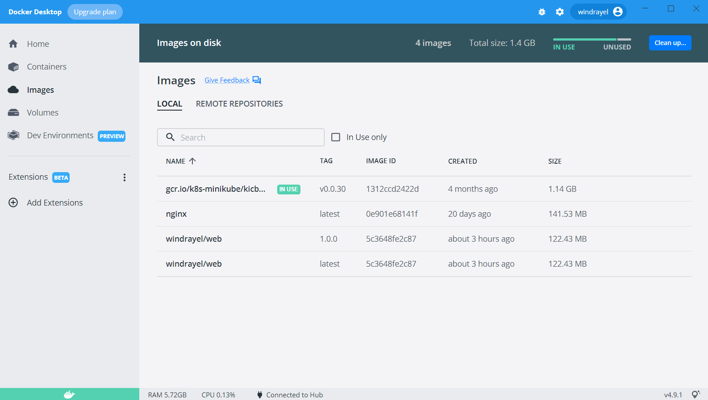
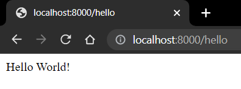
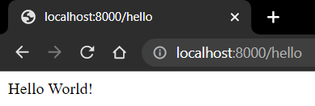

# Настройка
1. Docker установлен
2. Выполнен вход через docker login
3. Веб-приложение в формате jar архива находится в папке app
```shell
$ docker info

Client:
 Context:    default                                                                                
 Debug Mode: false                                                                                  
 Plugins:                                                                                           
  buildx: Docker Buildx (Docker Inc., v0.8.2)                                                       
  compose: Docker Compose (Docker Inc., v2.6.0)                                                     
  sbom: View the packaged-based Software Bill Of Materials (SBOM) for an image (Anchore Inc., 0.6.0)
  scan: Docker Scan (Docker Inc., v0.17.0)                                                          
                                                                                                    
Server:                                                                                             
 Containers: 2                                                                                      
  Running: 0                                                                                        
  Paused: 2
  Stopped: 0
 Images: 3
 Server Version: 20.10.16
 Storage Driver: overlay2
  Backing Filesystem: extfs
  Supports d_type: true
  Native Overlay Diff: true
  userxattr: false
 Logging Driver: json-file
 Cgroup Driver: cgroupfs
 Cgroup Version: 1
 Plugins:
  Volume: local
  Network: bridge host ipvlan macvlan null overlay
  Log: awslogs fluentd gcplogs gelf journald json-file local logentries splunk syslog
 Swarm: inactive
 Runtimes: runc io.containerd.runc.v2 io.containerd.runtime.v1.linux
 Default Runtime: runc
 Init Binary: docker-init
 containerd version: 212e8b6fa2f44b9c21b2798135fc6fb7c53efc16
 runc version: v1.1.1-0-g52de29d
 init version: de40ad0
 Security Options:
  seccomp
   Profile: default
 Kernel Version: 5.10.16.3-microsoft-standard-WSL2
 Operating System: Docker Desktop
 OSType: linux
 Architecture: x86_64
 CPUs: 12
 Total Memory: 12.43GiB
 Name: docker-desktop
 ID: EVM6:BDLD:EJIP:RHSM:WCSW:FZOX:5MUC:Z5CC:4GH5:F2NR:KLWP:2KNL
 Docker Root Dir: /var/lib/docker
 Debug Mode: false
 HTTP Proxy: http.docker.internal:3128
 HTTPS Proxy: http.docker.internal:3128
 No Proxy: hubproxy.docker.internal
 Registry: https://index.docker.io/v1/
 Labels:
 Experimental: false
 Insecure Registries:
  hubproxy.docker.internal:5000
  127.0.0.0/8
 Live Restore Enabled: false
```

Цели:
1. Собрать приложение в Docker image
2. Запустить и проверить работу Docker контейнера
3. Залить Docker image на Docker Hub

# 1. Dockerfile
Создадим Dockerfile 
```Dockerfile
# Use openjdk:8 for java 8 support
FROM openjdk:8-jdk-alpine

ARG USER=app
ARG UID=1001

# -u is the UID
# -D permits to create an user without password
RUN adduser -u 1001 -D ${USER}\
   && mkdir -p /app \
   && chown -R ${USER}:${USER} /app
USER ${USER}

ARG JAR_FILE=/app/*.jar
COPY ${JAR_FILE} app.jar
ENTRYPOINT ["java","-jar","/app.jar"]

WORKDIR /app
EXPOSE 8000
```
Так как веб-приложение написано на Java, за базовый image берем openjdk-alpine. Не нужно самостоятельно устанавливать JDK и переменные окружения.

# 2. Docker image

Собираем Docker image
```shell
$ docker build -t dmizverev/web:1.0.0 -t dmizverev/web:latest .
[+] Building 1.6s (10/10) FINISHED
 => [internal] load build definition from Dockerfile                                                                                                                                                                                               0.0s 
 => => transferring dockerfile: 426B                                                                                                                                                                                                               0.0s 
 => [internal] load .dockerignore                                                                                                                                                                                                                  0.0s 
 => => transferring context: 2B                                                                                                                                                                                                                    0.0s 
 => [internal] load metadata for docker.io/library/openjdk:8-jdk-alpine                                                                                                                                                                            1.4s 
 => [auth] library/openjdk:pull token for registry-1.docker.io                                                                                                                                                                                     0.0s 
 => [internal] load build context                                                                                                                                                                                                                  0.1s 
 => => transferring context: 17.61MB                                                                                                                                                                                                               0.1s 
 => [1/4] FROM docker.io/library/openjdk:8-jdk-alpine@sha256:94792824df2df33402f201713f932b58cb9de94a0cd524164a0f2283343547b3                                                                                                                      0.0s 
 => CACHED [2/4] RUN adduser -u 1001 -D app   && mkdir -p /app    && chown -R app:app /app                                                                                                                                                         0.0s 
 => CACHED [3/4] COPY /app/*.jar app.jar                                                                                                                                                                                                           0.0s 
 => CACHED [4/4] WORKDIR /app                                                                                                                                                                                                                      0.0s 
 => exporting to image                                                                                                                                                                                                                             0.0s 
 => => exporting layers                                                                                                                                                                                                                            0.0s 
 => => writing image sha256:5c3648fe2c874518584a85604f36c86068759805253fdab01d4f558b84f93526                                                                                                                                                       0.0s 
 => => naming to docker.io/windrayel/web:1.0.0                                                                                                                                                                                                     0.0s 
 => => naming to docker.io/windrayel/web:latest
```
На момент создания отчета image был уже залит на Docker Hub, поэтому используются закэшированные слои.
Созданные image показаны в Docker Desktop


# 3. Docker Container
Запускаем Docker container
```shell
$ docker run -p 8000:8000 windrayel/web                        

  .   ____          _            __ _ _
 /\\ / ___'_ __ _ _(_)_ __  __ _ \ \ \ \
( ( )\___ | '_ | '_| | '_ \/ _` | \ \ \ \
 \\/  ___)| |_)| | | | | || (_| |  ) ) ) )
  '  |____| .__|_| |_|_| |_\__, | / / / /
 =========|_|==============|___/=/_/_/_/
 :: Spring Boot ::                (v2.7.0)

2022-06-17 15:54:54.967  INFO 1 --- [           main] com.example.springboot.Application       : Starting Application v1.0.0 using Java 1.8.0_212 on 7f59081b0c63 with PID 1 (/app.jar started by app in /app)
2022-06-17 15:54:54.969  INFO 1 --- [           main] com.example.springboot.Application       : No active profile set, falling back to 1 default profile: "default"
2022-06-17 15:54:55.748  INFO 1 --- [           main] o.s.b.w.embedded.tomcat.TomcatWebServer  : Tomcat initialized with port(s): 8000 (http)
2022-06-17 15:54:55.761  INFO 1 --- [           main] o.apache.catalina.core.StandardService   : Starting service [Tomcat]
2022-06-17 15:54:55.761  INFO 1 --- [           main] org.apache.catalina.core.StandardEngine  : Starting Servlet engine: [Apache Tomcat/9.0.63]
2022-06-17 15:54:55.844  INFO 1 --- [           main] o.a.c.c.C.[Tomcat].[localhost].[/]       : Initializing Spring embedded WebApplicationContext
2022-06-17 15:54:55.845  INFO 1 --- [           main] w.s.c.ServletWebServerApplicationContext : Root WebApplicationContext: initialization completed in 822 ms
2022-06-17 15:54:56.167  INFO 1 --- [           main] o.s.b.w.embedded.tomcat.TomcatWebServer  : Tomcat started on port(s): 8000 (http) with context path ''
2022-06-17 15:54:56.178  INFO 1 --- [           main] com.example.springboot.Application       : Started Application in 1.534 seconds (JVM running for 1.919)
```
Проверим доступность приложения в браузере



# 4. Docker Hub

Отправим Docker image на Docker Hub
```shell
$ docker push  windrayel/web:1.0.0
The push refers to repository [docker.io/windrayel/web]
5f70bf18a086: Pushed
e819f1608723: Pushed
ceaf9e1ebef5: Mounted from library/openjdk
9b9b7f3d56a0: Mounted from library/openjdk
f1b5933fe4b5: Mounted from library/openjdk
1.0.0: digest: sha256:2d778490e32fd8f1c01f40649e0f023f57bcc1b5166c7ee823b7929ebd05ebf9 size: 1573
$ docker push  windrayel/web:latest
The push refers to repository [docker.io/windrayel/web]
5f70bf18a086: Layer already exists
e819f1608723: Layer already exists
04f6d4d9e207: Layer already exists
ceaf9e1ebef5: Layer already exists
f1b5933fe4b5: Layer already exists
latest: digest: sha256:2d778490e32fd8f1c01f40649e0f023f57bcc1b5166c7ee823b7929ebd05ebf9 size: 1573
```
Ссылка на репозиторий https://hub.docker.com/repository/docker/windrayel/web

Скачаем docker image из Docker Hub
```shell
$ docker pull windrayel/web:1.0.0
1.0.0: Pulling from windrayel/web
Digest: sha256:2d778490e32fd8f1c01f40649e0f023f57bcc1b5166c7ee823b7929ebd05ebf9
Status: Image is up to date for windrayel/web:1.0.0
docker.io/windrayel/web:1.0.0
```

# Kubernetes
В рамках работы с kubernetes будет использоваться minikube

Задачи:
1. Запустить кластер
2. Создать pod manifest 
3. Установить manifest в кластер
4. Обеспечит доступ к веб-приложению

# 1. Кластер
Запускаем кластер
```shell
minikube start
* minikube v1.25.2 на Microsoft Windows 10 Pro 10.0.19043 Build 19043
* Используется драйвер docker на основе существующего профиля
* Запускается control plane узел minikube в кластере minikube
* Скачивается базовый образ ...
* Перезагружается существующий docker container для "minikube" ...
* Подготавливается Kubernetes v1.23.3 на Docker 20.10.12 ...
  - kubelet.housekeeping-interval=5m
* Компоненты Kubernetes проверяются ...
  - Используется образ gcr.io/k8s-minikube/storage-provisioner:v5
* Включенные дополнения: default-storageclass, storage-provisioner
* Готово! kubectl настроен для использования кластера "minikube" и "default" пространства имён по умолчанию
```
Статус кластера
```shell
$ minikube status
minikube
type: Control Plane
host: Running
kubelet: Running
apiserver: Running
kubeconfig: Configured
```

# 2. Pod manifest
Создаем yaml файл Pod manifest
```yaml
apiVersion: v1
kind: Pod
metadata:
  name: web
spec:
  containers:
  - name: web
    image: windrayel/web:1.0.0
    imagePullPolicy: IfNotPresent
```

# 3. Установка манифеста в кластер
Устанавливаем при помощи созданного файла
```shell
$ kubectl apply -f pod.yaml
pod/web created
```

Посмотрим за установкой pod
```shell
$ kubectl get pod web --watch
NAME   READY   STATUS    RESTARTS   AGE
web    1/1     Running   0          9s
```

# 4. Доступ к веб-приложению

Пока что мы не имеем доступа к приложению с гипервизора. Чтобы его получить нужно пробросить порты
```shell
$ kubectl port-forward pods/web 8000:8000
Forwarding from 127.0.0.1:8000 -> 8000
```
Когда в браузере мы заходим на нужный адрес в командной строке видим соответсвующее сообщение
```shell
Handling connection for 8000
```
Доступ к приложению есть

